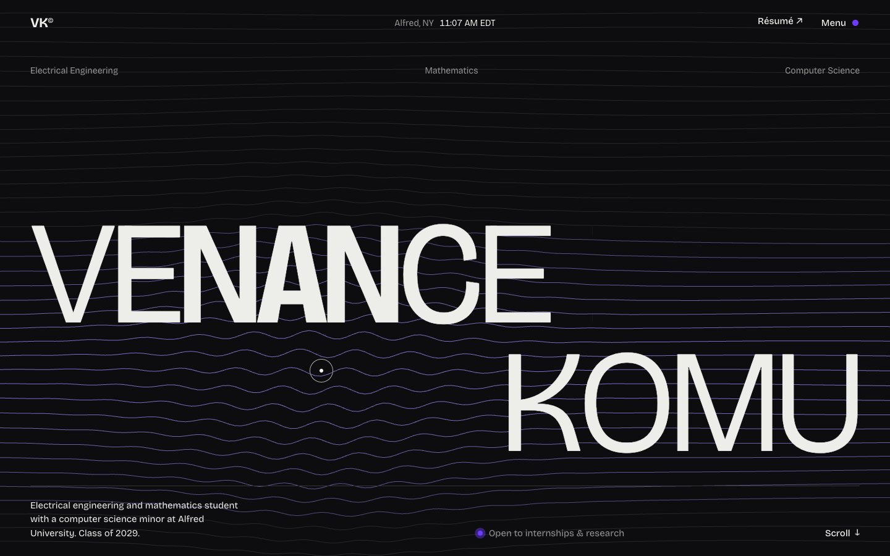

# venancekomu03-hub.github.io

Personal website of **Venance Komu**, electrical engineering and mathematics student at Alfred University (computer science minor, class of 2029).

**Live:** https://venancekomu03-hub.github.io



## What's in it

- **Hero** with signal-trace lines drawn on a canvas that bend around the cursor, and a variable font whose letters thicken and narrow as the pointer gets close.
- **Experience** as rows that start open (each can be collapsed), with a small animated preview that follows the cursor.
- **Projects** in a pinned section where scrolling down, or swiping sideways on a trackpad, moves the cards sideways.
- **Generated artwork** for each project (an illustrative XRF spectrum, a delivery route with geofences, a battery bank, a KNN plot), built as SVG in JavaScript.
- Page colour that changes with the section, a full-screen menu, a custom cursor, and magnetic buttons.

Every animation is skipped for visitors who have *reduce motion* turned on, and the content is fully readable without JavaScript.

## Stack

Plain HTML, CSS and JavaScript, with no frameworks or build step. Type is [Bricolage Grotesque](https://fonts.google.com/specimen/Bricolage+Grotesque). Developed and debugged with GitHub Copilot CLI and Claude Code, and hosted on GitHub Pages.

```
index.html   page content
styles.css   layout, theme and animation
script.js    interactions and generated artwork
assets/      résumé PDF
```

## Run locally

Open `index.html` in a browser. Nothing to install.

---

The accent violet is gallium's 417 nm spectral line, a nod to my research on secondary sources of gallium.
